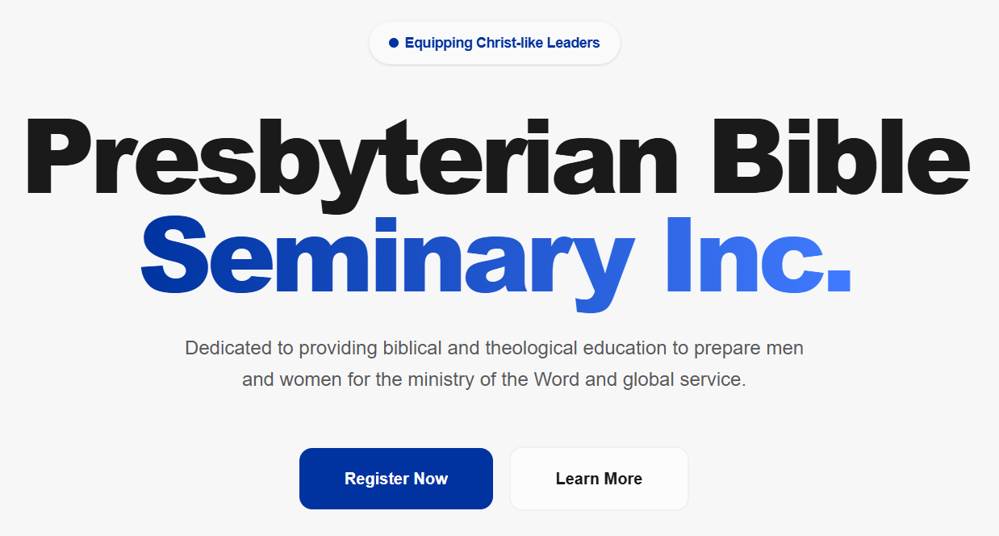

# PBSI: Presbyterian Bible Seminary Inc.



## Short Introduction

This project is the official digital platform for **Presbyterian Bible Seminary Inc. (PBSI)** and represents a major institutional digital transformation initiative.

The goal was to replace outdated manual systems with a centralized digital platform that improves enrollment processes, information accessibility, and administrative efficiency.

Before this system:

- Student records were heavily manual  
- Inquiries were fragmented  
- Program information was difficult to maintain  
- Administrative workflows were slower  

This platform was designed to modernize institutional operations while creating a better experience for students, faculty, and administrators.

**Live Site:** https://pbsi1992.github.io

---

## Project Goal

Create a centralized digital ecosystem that handles:

- Student inquiries  
- Admissions  
- Program information  
- Institutional branding  
- Administrative efficiency  

while reducing dependency on manual processes.

---

## Technologies Used

### Core Framework
- Astro 4.x

Used because:

- Extremely fast static generation  
- Better SEO  
- Lower hosting costs  
- Easier maintenance  

---

### Frontend
- Tailwind CSS
- Responsive UI Design
- Glassmorphism Components

---

### Interactive Components
- React Components
- Dynamic Form Handling
- State Management

---

### Data Layer
- Astro Content Collections
- JSON-based content architecture

---

### Deployment
- GitHub Pages
- GitHub Actions
- is-a.dev infrastructure

---

## Features

### Automated Admissions System
Handles:

- Student registration  
- Program selection  
- Requirement submission  

This reduces manual administrative workload.

---

### Dynamic Academic Program System
Maintains synchronization across:

- Master’s programs  
- Bachelor’s programs  
- Diploma programs  
- Academic tracks  

Using JSON-driven architecture improves scalability.

---

### Inquiry Hub
Allows:

- Student inquiries  
- Registrar communication  
- Centralized communication flow  

This improves response efficiency.

---

### Theme Engine
Users can choose:

- Light mode  
- Dark mode  

Preferences persist through local storage.

---

### Institutional Website
Functions as the primary source of information for:

- Prospective students  
- Current students  
- Faculty  
- External stakeholders  

---

## Development Process (How It Was Built and Why)

---

### Why I Built It

Many educational institutions still operate with outdated workflows.

Common problems included:

- Manual paperwork  
- Poor accessibility  
- Slow communication  
- Difficult content management  

These inefficiencies create operational bottlenecks.

This project applies digital transformation strategy:

Manual Systems → Digital Infrastructure → Operational Efficiency

---

### Step 1: Problem Analysis

Identified institutional pain points:

- Enrollment friction  
- Information fragmentation  
- Administrative delays  

---

### Step 2: System Planning

Designed:

- Student journey flows  
- Admin workflows  
- Program content architecture  
- Inquiry systems  

---

### Step 3: Development

Built modular architecture for easier maintenance.

This reduces technical debt over time.

---

### Step 4: Optimization

Focused on:

- Fast loading speeds  
- Mobile responsiveness  
- Accessibility improvements  
- Better navigation  

Students often access websites through mobile devices, making optimization important.

---

### Step 5: Deployment

Deployed through GitHub Pages with GitHub Actions for streamlined updates.

---

## System Modules

| Module | Functionality |
|----------|----------------|
| Admissions Engine | Student registration and document submission |
| Academic Hub | Program directory and academic content |
| Inquiry Hub | Communication routing |
| Theme Engine | Preference persistence |

---

## What I Learned

### Technical Skills
- Astro architecture  
- Content collections  
- React integration  
- Static site optimization  

---

### Business Skills
- Digital transformation planning  
- Workflow optimization  
- Stakeholder-focused design  

---

### Organizational Lessons
I learned that institutions often resist change because of transition costs.

Building systems requires balancing:

- Technical feasibility  
- User adoption  
- Operational practicality  

---

## How to Improve It

### Short-Term Improvements
- Better form validation  
- Search functionality  
- More analytics tracking  

---

### Medium-Term Improvements
- Admin dashboard  
- Student portal integration  
- Automated notifications  

---

### Long-Term Improvements
- Full enrollment management system  
- Learning management integration  
- Payment gateway support  

---

## How to Run the Project

### Clone Repository
```bash
git clone https://github.com/pbsi1992/pbsi1992.github.io.git
```

### Enter Project Folder
```bash
cd pbsi1992.github.io
```

### Install Dependencies
```bash
npm install
```

### Start Development Server
```bash
npm run dev
```

### Build for Production
```bash
npm run build
```

---

## Creator

**Jero Halili**  
Computer Scientist • Full-Stack Developer • AI Engineer  

Built for PBSI Digital Transformation (2026–2027)

Portfolio: https://jerohalili.is-a.dev  
GitHub: https://github.com/jerohalili